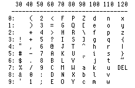
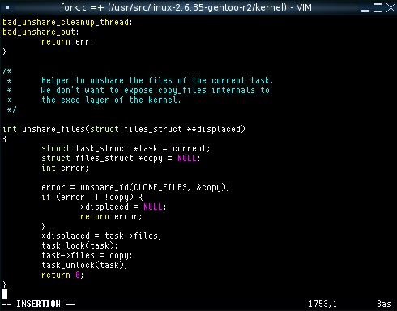
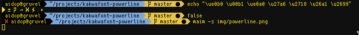

# KakwaFont

Another 12px monospace bitmap font but with added powerline glyphs.

## Presentation

This is a fork of KakwaFont adding a few powerline characters. All other characters are unchanged. Note: the bold version does not have the extra chaaracters.

KakwaFont is a 12px monospace bitmap font based on [Terminus](http://terminus-font.sourceforge.net/).

I found Terminus too wide, so I have changed most glyphs in order to have thin and clearly seperated characters.

I tried to make a clear difference between "(" and "{", "1" and "l", "0" and "O"...

The result is a clear font, well suited for programming and terminal.

## Examples

Ascii Table: 



Test: 


Code example: 



Powerline example:



## License

KakwaFont is licensed under the SIL Open Font License, Version 1.1. 

The license is available with a FAQ at [scripts.sil.org](http://scripts.sil.org/cms/scripts/page.php?site_id=nrsi&id=OFL).

## Download

Clone the repo for the latest version

```bash
$ git clone https://github.com/AidoP/kakwafont-powerline
```

## Install

To install this font, you need *bdftopcf*, *bdf2psf* (For console/tty support) and *mkfontdir* (provided by the *xfonts-utils* package in Debian/Ubuntu)

```bash
# build the .pcf.gz and psf
$ make

# install
# supports param DESTDIR and FONTDIR
# INDEX=true triggers mkfontdir
$ make install INDEX=true # DESTDIR=./installroot/ FONTDIR=/usr/share/fonts/X11/misc

# show kakwafont name
$ xlsfonts |grep kakwafont
```

To change your console font, add `FONT="/usr/share/fonts/X11/misc/kakwafont-12-n.psf"` to `/etc/rc.conf` (Probably different with systemd)
